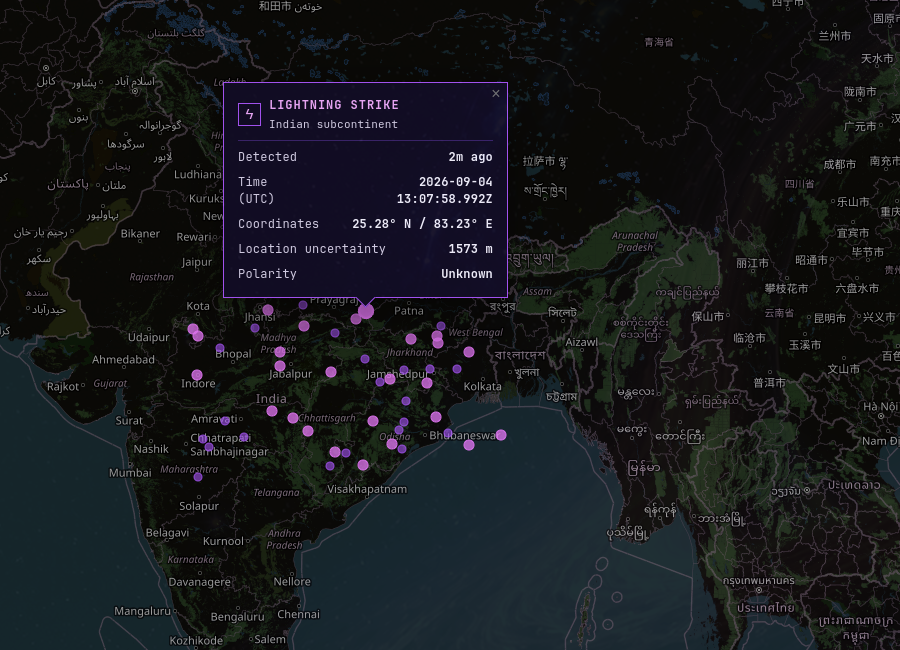
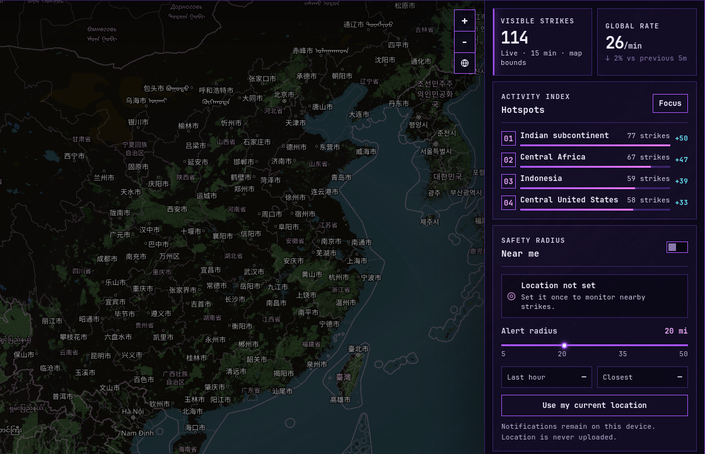

# Stormtrace

**Live lightning intelligence, built for Omarchy.**

Stormtrace turns a small lightning icon in the Omarchy bar into a dedicated desktop monitor for worldwide lightning activity. Follow storms from a global view, inspect individual strikes, watch active regions emerge, and receive private proximity alerts without opening a browser window.


Stormtrace opens as a centred, resizable desktop window. Expand it to fullscreen when you want the widest possible storm view, then restore it to the same contained layout.

> The product images use Stormtrace's built-in demo feed so the tour remains consistent. The installed app connects to the live LightningMaps/Blitzortung feed by default.

## What Stormtrace gives you

- **A live global map** with draggable, zoomable coverage and clear strike-age colours.
- **Strike-level detail** including detection time, coordinates, location uncertainty, polarity when available, and distance from your saved position.
- **Useful time windows** for live activity, the past hour, six hours, or the rolling 24-hour local archive.
- **Activity intelligence** with visible-strike totals, estimated global rate, hotspot ranking, and the latest detected strike.
- **Private nearby alerts** with a configurable 5–50 mile safety radius and a two-minute notification cooldown.
- **A native Omarchy experience** with a contained GTK window, one-click fullscreen and restore & single-instance focus behaviour.
- **Theme-aware presentation** that follows the active Omarchy palette or uses a saved Stormtrace colour scheme.
- **A built-in update check** that compares the installed app with the version currently published for Omarchy.

## See the storm at every scale

### Move from global awareness to regional activity

Select the leading hotspot to move directly from the world view into the most active region. Strike colour communicates age, while map overlays keep the visible region, age legend, and latest detection in view.


### Inspect an individual strike

Hover a marker for a quick anchored preview. Select it for persistent details that remain open while new strikes arrive; select it again or use the close button to dismiss it.



### Track activity and what is near you

The sidebar combines visible activity, rate changes, ranked hotspots, and proximity monitoring. Your chosen location and alert radius stay on the device.



### Make it feel native to your desktop

Stormtrace follows the active Omarchy theme automatically. The Appearance panel also provides a private custom palette plus brightness, opacity, and edge-shade controls for the map.


## Install on Omarchy

Install the native runtime once:

```bash
omarchy pkg add python-gobject gtk3 webkit2gtk-4.1
```

Add and enable Stormtrace:

```bash
omarchy plugin add https://github.com/Ashcutus/Stormtrace.git --enable
```

The lightning icon appears on the right side of the bar. Select it to start and open Stormtrace. Selecting it again focuses the existing window instead of creating another instance.

### Add Stormtrace to the app launcher

To make Stormtrace available from `SUPER + SPACE` as well as the bar:

```bash
~/.config/omarchy/plugins/stormtrace.lightning/install-omarchy.sh
```

The plugin does not use install hooks, `sudo`, or a boot-enabled service. Its local service starts on demand and stops when you exit Stormtrace.

## Everyday controls

| Action | Result |
| --- | --- |
| Hover a strike | Show a stable summary with region, age, and coordinates. |
| Select a strike | Keep its extended details open through live updates. |
| Drag / scroll | Move or zoom the map. |
| `Live` / `1h` / `6h` / `24h` | Change the strike-age window. |
| `Focus` | Move to the leading activity hotspot. |
| `Set location` | Save or update the position used for distance and alerts. |
| `Near me` | Enable or disable private desktop notifications. |
| Alert radius | Choose a proximity threshold from 5 to 50 miles. |
| Pause / play | Stop or resume the live feed while keeping the map and history open. |
| Expand / restore | Switch between the contained window and fullscreen. |
| About | Review data notes and check whether a newer Stormtrace version is available. |
| Power | Exit Stormtrace and stop its local service cleanly. |

### Keyboard shortcuts

| Key | Action |
| --- | --- |
| `/` | Focus place or coordinate search. |
| `L` | Return to the live time window. |
| `G` | Request or update your location. |
| `N` | Toggle nearby notifications. |
| `P` | Pause or resume monitoring. |
| `R` | Reconnect the live receiver. |
| `+` / `−` | Zoom the map. |
| `F11` | Enter fullscreen or return to the contained window. |
| `Ctrl+Q` | Exit Stormtrace and stop its local service. |

## Local by design

- Geolocation, alert settings, map appearance, custom colours, and rolling strike history stay in Stormtrace's local application profile.
- Location is used only to calculate distance and nearby notifications; Stormtrace does not upload it.
- The rolling archive is stored in IndexedDB, covers up to 24 hours, and is capped at 30,000 strikes.
- Notifications use a two-minute cooldown to avoid alert storms.
- The local web server binds to `127.0.0.1`, starts with the dedicated GTK window, and stops during a normal app exit.

## Data and limitations

Live strikes come from the unofficial, unauthenticated LightningMaps/Blitzortung WebSocket feed. Coverage, detection latency, and upstream availability vary by region. Stormtrace reconnects automatically, but it is situational-awareness software—not a safety-critical warning system.

A new installation builds its rolling history while it runs. Optional historical backfill is available through `LIGHTNING_API_KEY`; copy `.env.example` to `.env`, add the key, and restart the receiver. The key remains server-side, and the provider plan must support the requested history window.

Blitzortung data is for private, non-commercial use.

- [Blitzortung project and data-use guidance](https://www.blitzortung.org/en/compendium.php)
- [LightningMaps documentation](https://docs.lightningmaps.org/)
- [Optional Lightning API documentation](https://lightningapi.dev/docs)
- [OpenStreetMap copyright](https://www.openstreetmap.org/copyright)

## Update or remove

Open **About Stormtrace and updates** from the information button, then select **Check for updates**. Stormtrace only checks the version published by this repository; it does not download or install anything automatically.

Update an existing git-managed installation:

```bash
omarchy plugin update stormtrace.lightning --yes
```

Close and reopen Stormtrace after updating so the native window loads the new application code and styles.

Remove the launcher entry and plugin:

```bash
~/.config/omarchy/plugins/stormtrace.lightning/uninstall-omarchy.sh
omarchy plugin remove stormtrace.lightning
```

## Troubleshooting

### Stormtrace does not open

Check the receiver and native runtime:

```bash
curl http://127.0.0.1:4177/api/health
systemctl --user status stormtrace-receiver.service
python3 -c 'import gi; gi.require_version("Gtk", "3.0"); gi.require_version("WebKit2", "4.1"); from gi.repository import Gtk, WebKit2'
```

Receiver logs are available with:

```bash
journalctl --user -u stormtrace-receiver.service
```

If a previous crash left the local service running, stop it safely with:

```bash
~/.config/omarchy/plugins/stormtrace.lightning/start-app.sh --stop
```

### The map is blank or strikes are missing

The map needs network access for Leaflet, OpenStreetMap tiles, and the live WebSocket feed. Use the refresh button or press `R` to reconnect. The built-in demo feed can confirm that the interface itself is working.

### Older time windows are empty

The 24-hour archive is local and begins filling when Stormtrace first runs. Full historical backfill requires the optional provider configuration described above.

### Theme colours are not updating

Stormtrace reads the active Omarchy palette through its local API. If that is unavailable, it uses its built-in palette; saved custom colours remain available from Appearance.

## For contributors

The product has no npm runtime dependencies. Node.js 20+ serves the app when available, with Python 3 as a zero-dependency fallback.

Start the local server:

```bash
./start.sh
```

Launch the native shell:

```bash
./start-app.sh
```

For a stable interface walkthrough without waiting for live activity, open:

```text
http://127.0.0.1:4177/?demo=1
```

Run the project checks before committing:

```bash
npm run check
bash -n start.sh start-app.sh install-omarchy.sh uninstall-omarchy.sh
git diff --check
omarchy plugin validate .
```

The repository includes the marketplace manifest, QML bar entry point, native GTK shell, local servers, safe launcher scripts, and a [publishing checklist](PUBLISHING.md).

## Licence

Stormtrace is released under the [MIT Licence](LICENSE). Lightning data remains subject to the source network's private, non-commercial usage terms.
