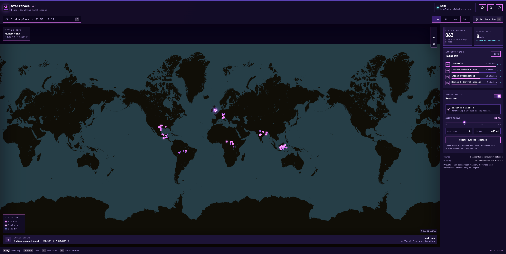
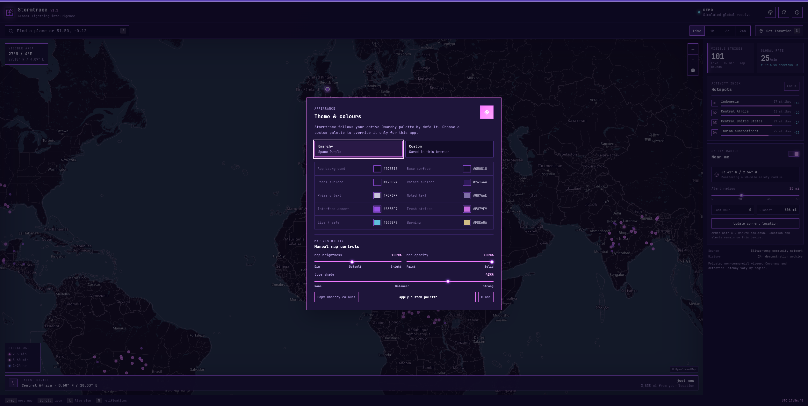
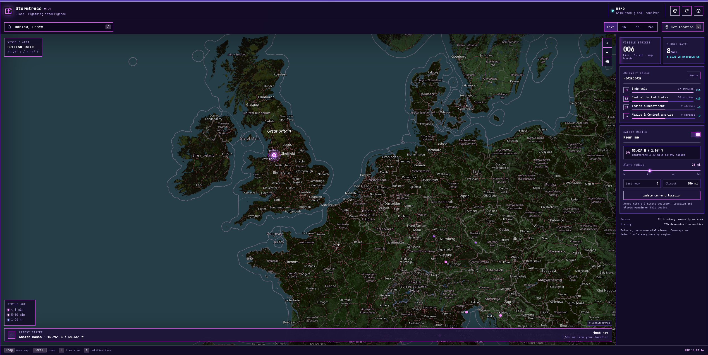

# Stormtrace for Omarchy

Stormtrace is a theme-aware Omarchy bar widget and local lightning monitor. It displays a draggable, zoomable global map; receives near-real-time lightning strikes; keeps a rolling on-device history; identifies activity hotspots; and can notify you about strikes inside a configurable radius.

## Features

- Global live strike map with live, 1-hour, 6-hour, and rolling 24-hour views.
- Hover a strike for a quick summary; click one for persistent extended details including detection time, coordinates, uncertainty, and polarity when available.
- Activity hotspots, latest-strike summary, global strike rate, and proximity statistics.
- Optional browser geolocation and desktop notifications, with a configurable 5–50 mile radius.
- Automatic Omarchy dark/light theme inheritance or a saved custom palette.
- Manual map brightness, map opacity, and edge-shade controls.
- Local IndexedDB history with an optional server-side historical backfill provider.
- Demo mode for testing the interface without waiting for the live stream.

## Screenshots

The screenshots below were captured from the local demo build. To reproduce them, run:

```text
http://127.0.0.1:4177/?demo=1
```



*Global map overview with live strike markers, hotspots, proximity status, and the latest-strike strip.*



*Appearance dialog with manual map brightness, opacity, and edge-shade controls.*



*Regional map view showing detailed basemap labels and strike activity.*

Hovering a strike shows its quick summary; clicking one opens the persistent extended strike details.

## Install as an Omarchy plugin

Install and enable the public plugin with:

```bash
omarchy plugin add https://github.com/Ashcutus/Stormtrace.git --enable
```

The lightning icon appears on the right side of the Omarchy bar. Select it to start the local server and open or focus Stormtrace. The widget lights up while the receiver is running.

The plugin does not use install hooks, `sudo`, or a background system service. Its server starts only when requested.

## Update to the latest version

For an existing git-managed installation, run:

```bash
omarchy plugin update stormtrace.lightning --yes
```

Then select the Stormtrace bar icon again. If the app was already open, refresh or close and reopen its web-app window so the updated JavaScript and styles are loaded.

To check the installed plugin:

```bash
omarchy plugin list
```

For a source checkout, pull the latest changes and restart the local server:

```bash
git pull
./start.sh
```

Remove the plugin cleanly with:

```bash
omarchy plugin remove stormtrace.lightning
```

## Run without the plugin

The launcher uses Node.js 20+ when available and falls back to Python 3:

```bash
./start.sh
```

Open [http://127.0.0.1:4177](http://127.0.0.1:4177), or use the Omarchy web-app launcher:

```bash
./start-app.sh
```

To install an optional standalone launcher entry:

```bash
./install-omarchy.sh
```

Then press `SUPER + SPACE` and search for **Stormtrace**. The project has no package-manager dependencies.

## Using the app

### Map interactions

| Interaction | Result |
| --- | --- |
| Hover a strike | Shows its region, age, and coordinates. |
| Click a strike | Opens extended details and keeps them open until dismissed. |
| Drag / scroll | Move and zoom the map. |
| `+` / `−` | Zoom in or out. |
| World button | Return to the global view. |
| `/` | Focus place search. Coordinates such as `51.50, -0.12` are supported. |

### Controls and shortcuts

| Control | Action |
| --- | --- |
| Live / 1h / 6h / 24h | Change the strike-age window. |
| Set location | Request or update the local monitoring position. |
| Near me switch | Enable or disable browser notifications. |
| Alert radius | Set the proximity radius from 5 to 50 miles. |
| Focus | Fly to the leading hotspot. |
| `L` | Return to the live time window. |
| `G` | Request or update your location. |
| `N` | Toggle proximity notifications. |
| `R` | Reconnect the strike stream. |

### Appearance controls

Open the palette button in the app header and use **Manual map controls**:

- **Map brightness** adjusts tile brightness from 70% to 140%.
- **Map opacity** adjusts tile opacity from 55% to 100%.
- **Edge shade** controls the map’s edge vignette from 0% to 60%.

These values are stored in the current browser profile. The same dialog can switch between automatic Omarchy colours and a saved custom palette. Custom colours are also stored only in that browser profile.

## Data, privacy, and limitations

- Live strikes use the unofficial, unauthenticated LightningMaps/Blitzortung WebSocket feed. The connection is worldwide and reconnects with exponential backoff.
- The last 24 hours are retained locally in IndexedDB, capped at 30,000 strikes. A new installation builds its older time windows as the app runs.
- Optional historical backfill requires a `LIGHTNING_API_KEY`. Copy `.env.example` to `.env`, add the key, and restart the server. The key remains server-side, and the provider plan must support a 1,440-minute window.
- Geolocation, the alert radius, map appearance settings, and custom colours are stored only in the local browser profile.
- Notifications use a two-minute cooldown to avoid alert storms. Location is never uploaded by Stormtrace.
- Coverage and detection latency vary by region. This app is situational-awareness software, not a safety-critical warning system.

The community network does not provide a supported public historical-strike API; participant archive access is restricted. Stormtrace labels local history honestly rather than presenting generated data as live.

### Demo mode

Add `?demo=1` to the local URL:

```text
http://127.0.0.1:4177/?demo=1
```

Demo mode uses a deterministic 24-hour activity field and adds simulated current strikes so map interactions, popups, filters, and appearance controls can be tried without the live feed.

## Troubleshooting

### The app will not open

Check that the local receiver is healthy:

```bash
curl http://127.0.0.1:4177/api/health
```

If another process is using port `4177`, stop that process or choose a different port for a direct server run:

```bash
STORMTRACE_PORT=4178 npm start
```

Then open `http://127.0.0.1:4178` directly. `start-app.sh` expects the default port unless it is changed as well.

### The map is blank or strikes are missing

The map needs network access to load Leaflet, OpenStreetMap tiles, and the live WebSocket feed. Use demo mode to separate UI issues from feed or network issues. The refresh button or `R` reconnects the feed.

### Historical views are empty

The rolling archive is local to the browser and starts filling when the app first runs. Full 24-hour backfill is optional and requires the provider configuration described above.

### Theme colours are not updating

Stormtrace reads the active Omarchy theme through its local API. If that is unavailable, it uses the built-in fallback palette. The custom palette remains available from the Appearance dialog.

## Sources

- [Blitzortung project and data-use guidance](https://www.blitzortung.org/en/compendium.php)
- [LightningMaps documentation](https://docs.lightningmaps.org/)
- [Optional Lightning API documentation](https://lightningapi.dev/docs)
- [OpenStreetMap copyright](https://www.openstreetmap.org/copyright)

Blitzortung data is for private, non-commercial use.

## Development and publishing

Run the built-in checks before committing:

```bash
npm run check
git diff --check
```

The repository includes the marketplace `manifest.json`, QML bar entry point, MIT licence, safe launcher scripts, and a [publishing checklist](PUBLISHING.md). Validate a release with:

```bash
omarchy plugin validate .
```
