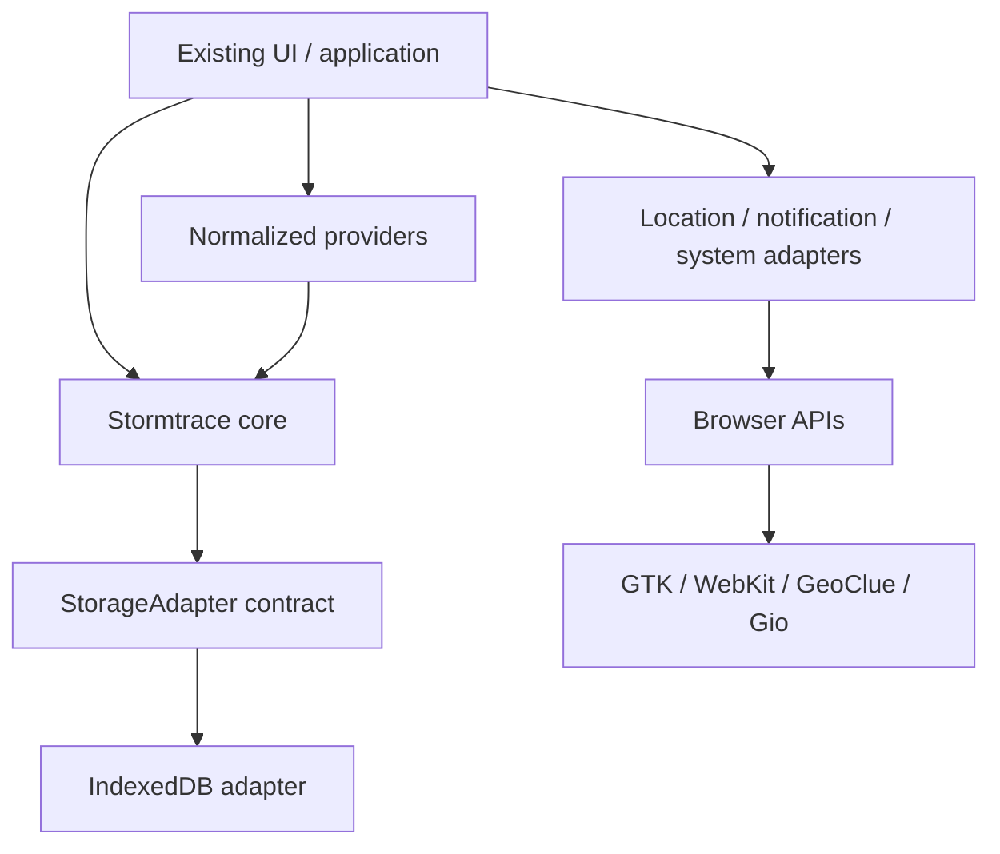

# Stormtrace architecture

This guide describes the current code boundaries and compatibility rules. The historical [Phase 0 audit and delivery record](phase-0.md) explains how the foundations were introduced. Implementation and release status live in the [rollout tracker](rollout.md).

## Boundaries

Architecture rules:

- **No platform API above the platform-adapter boundary.** Composition roots may choose adapters and configure transport; core and hazard providers never invoke Linux APIs or choose filesystem paths.
- **No UI component should understand an upstream provider API format.** UI consumes normalized strike/place/event/measurement/frame models. Transport lifecycle can remain application-managed during incremental extraction.
- **Provider-native severity/classification must be preserved.** Display priority is a separate internal ordering/prominence concept, never an authoritative danger score.

`core/model.js`, `geometry.js`, `history.js`, `xml.js` and `cap.js` run in a browser or Node without platform imports. They expose `StormtraceCore` to V1's classic scripts. `core/index.js` is the Node entry point for the same implementations. `core/contracts.d.ts` documents the JavaScript contracts; this is not a TypeScript migration or a compiled runtime validation system. Browser script order is explicit in `index.html`.

`providers/` owns upstream formats, normalization, metadata and structured retrieval failures. `platform/browser.js` implements location, neutral notification intents, settings and atomic revision storage; `platform/strike-cache.js` retains V1 cache mechanics. `platform/node.js` and `stormtrace_platform.py` implement theme/key/profile/native-notification mechanisms. The GTK shell, launch scripts and bar widget are themselves Linux system-integration adapters and remain Linux-specific. No speculative Windows/macOS implementation is included.

## Events, provenance and domain data

`StormtraceEvent<K, P, S>` retains identity, kind, provider, authority, observation/update/validity times, GeoJSON geometry, native severity, display priority, provenance and a domain payload. All times are UTC epoch milliseconds, nullable when not supplied. Event construction validates required identity relationships, priority, timestamps and geometry. Source-native values can be strings or structured values (magnitude/status, G/R/S scales, official classifications).

Payload contracts cover warnings, earthquakes, cyclone tracks/forecasts/cones, volcanoes, tsunamis, lightning and linked space-weather events. Radar uses frame resources and bounds; space weather has distinct current measurements, time series and event capabilities. These are not coerced into discrete events. History accepts event envelopes; a future measurement/frame archive can use the same atomic storage contract with its own record model.

Provenance contains provider, source authority/URL, upstream ID, fetch time, source observation/update times and named transformations. `provenanceFreshness` resolves expected cadence from the source registry. Unknown source times stay null. The legacy live display fallback for a missing strike time remains fetch time, explicitly marked `time-inferred-from-fetch` while source observation time stays null. Legacy strikes remain valid cache records; no fetch time or authority is fabricated for them. New live and backfill records retain provenance through application normalization and cache reloads. Python backfill returns its actual fetch time; the browser provider resolves authority from the same canonical registry.

## History and retention

`RevisionHistory` uses `StorageAdapter.get/update/entries`. `update` is an atomic synchronous read-modify-write callback; returning null deletes a row. The IndexedDB adapter fulfills that contract with one readwrite transaction. Enumeration uses bounded bulk key/value reads in one readonly transaction, relying on IndexedDB structured clones for detached snapshots; it avoids a cursor callback per row. Retention skips unchanged and unrelated rows before opening write transactions, and rechecks eligible changes atomically. The memory adapter is for deterministic tests, not production fallback pretending to be durable. See the [native soak investigation](performance-2026-10-07.md).

The separate IndexedDB database `stormtrace-revisions`, version 1, contains an `events` store. Keys encode `[provider, eventId]`. Each event row holds ordered immutable revision snapshots with sequence and persistence time. Each snapshot retains all source timestamps and provenance. Duplicate latest content is compared using exact canonical serialization with stable object key order; fetch time alone is excluded. This avoids hash collisions and duplicate fetch snapshots. Changes to source update time, severity, geometry or domain content produce a revision, as does a later reversion to earlier content. Original fetch time stays attached to the revision that was actually persisted; provider health tracks repeated successful fetches separately.

`revisions(provider, id)` queries one event; `query({from,to,provider,time})` returns matching revisions by observation, update, fetch or persistence time. Queries currently scan bounded local rows; they are not a distributed event store. `retain({before,keepLatest,provider,maxEvents})` explicitly selects a persistence-time cutoff and optionally preserves each latest revision. Policies are caller-owned. An optional event-count budget evicts the oldest persisted event rows, without deleting a row changed during selection. V1 invokes a 24-hour/30,000-event budget per source only for its two lightning sources, never for future warnings. Revision persistence is best effort if browser storage is unavailable; failures are logged and the live receiver continues.

No existing settings/schema migration is required: both the settings key and V1 database/schema remain unchanged. Creating the independent revision database is additive and idempotent. Old installations can open their original strike database without a downgrade or conversion. New records carry optional extra provenance fields. Demo mode bypasses real feeds and revision persistence.

Warnings use a provider-scoped 90-day/5,000-event revision policy and a separate `stormtrace-warning-state` database for the last successful normalized snapshot. `client/warnings.js` reconciles replayed source versions without reverting newer local history. Cancelling a warning removes it from the current issued list but preserves its observed revisions. No existing settings/cache schema is migrated. See [Phase 1](phase-1.md#persistence-and-compatibility) for source-window and durability limitations.

Radar frames use a separate resource contract and in-memory three-hour/12-frame cache, with no event/strike-history migration. Local platform adapters run the shared optional Python ODIM decoder; normalized frame metadata and PNGs are exposed over local HTTP. The browser adds a Leaflet raster pane between basemap and lightning markers, preserving the existing map stack. Mercator reprojection/cropping occurs before presentation. See [radar implementation](radar.md#implementation-and-validation).

## Geometry and CAP

GeoJSON longitude/latitude is canonical. `normalizeGeometry` validates and returns a detached Point, LineString, MultiLineString, Polygon or MultiPolygon; malformed input returns null. Rings must be closed and positions finite and within geographic ranges. Helpers provide bounds, haversine distance in kilometres, Feature conversion and point-in-polygon including holes and ordinary antimeridian crossings. Bounds are conservative numeric envelopes (a dateline-crossing polygon can span nearly the whole longitude range). These are basic interchange utilities, not topology repair, geodesic area calculations or a general GIS engine; self-intersection and complex polar geometry need provider-specific diagnostics/further geometry work.

`parseXML` provides the bounded XML tree shared by CAP and NSWWS Atom parsing; providers apply namespace/schema rules. `parseCAP` is a bounded, dependency-free CAP XML parser, not an XSD validator. It accepts namespace-qualified CAP 1.1/1.2, XML declarations, comments, CDATA and escaped text; rejects DTD/entity expansion, excessive input/depth, broken XML and unsupported declared CAP namespaces. It parses identity/sender/source/sent/status/message type/scope, references, multilingual info blocks, categories/event, urgency/severity/certainty, effective/onset/expiry, headline/description/instruction, parameters/resources and areas. Unknown fields and attributes are preserved in the parsed raw tree. It does not assign warning colours, priorities, event IDs or provider-specific warning policy.

CAP polygons reverse native latitude/longitude into GeoJSON. Unclosed rings are repaired explicitly with a diagnostic; malformed areas/timestamps/references produce diagnostics without losing the rest of the alert. Circles retain their native centre and kilometre radius, including zero radius; they are not silently approximated as polygons. Updates/cancellations retain references/message type for provider-specific reconciliation. Missing essential identity or invalid source dates require a provider to reject or quarantine the alert before publishing it. No parser-level default severity is invented. See the [OASIS CAP 1.2 specification](https://docs.oasis-open.org/emergency/cap/v1.2/CAP-v1.2-os.html) and synthetic fixtures in `tests/fixtures/`.

## Health, errors and observability

Health tracks attempted/successful fetches, source timestamp, expected cadence, last structured error and consecutive failures. Freshness distinguishes `fresh`, `delayed` (over 1.5 cadences), `stale` (over 3), `unavailable`, `malformed`, `provider_error` and `never_loaded`. Default source-based freshness can mark old source timestamps stale after a successful fetch. Event-driven warning feeds explicitly use `freshnessBasis: "fetch"` and age the successful fetch instead; an unchanged feed is not an upstream outage. Source timestamps remain intact. Unknown cadence means freshness cannot assert timeliness against a source SLA. Quiet lightning periods are different from transport failure: heartbeats refresh connection success without fabricating new observed strikes.

Provider errors distinguish network, upstream, timeout, authentication, rate limit, malformed response, unsupported schema, stale upstream, configuration, parse and unavailable. Public errors contain provider/operation/code/status/retry context, not original exception messages, credentials or raw payloads. Errors are isolated per provider. Partial record rejection retains usable records but reports malformed health. `ProviderRunner` validates batch result shape, records health and emits aggregate structured logs. Live logging is sampled to at most one healthy summary per minute; failures/rejection counts are emitted separately. Logs contain duration/count/source timestamp/freshness rather than per-record payloads. The lightning application exposes `state.providerHealth`; the optional warnings controller owns its separate health and reports it in the warnings view.

Opt-in soak diagnostics use a numeric-only platform HTTP snapshot and a separate standard-library Linux recorder. The browser aggregates counters; no filesystem operations or upstream payloads enter the diagnostic snapshot. Ten-second sampling and bounded session rotation are described in [the diagnostics guide](diagnostics.md). Disabled mode installs no diagnostic sampling timers. Native resource/overnight verification remains outstanding.

## Compatibility and technical debt

The existing feed subscription, strike IDs/time units, region presentation, history endpoint shape, settings, manual/coarse-location behaviour, reconnect/pause/demo logic, cooldown and launch behaviour are retained. Node and Python history responses add health/provenance metadata without removing `configured`/`flashes`. Polarity and deviation now survive normalized cache reloads instead of being discarded. The manifest remains the sole application version source.

Deliberate debt: the application still owns WebSocket reconnect/pause lifecycle and strike-specific relevance/rendering; the V1 cache is separate from general revisions to avoid a risky migration. Python maintains duplicate historical and warnings transports/normalizers, tested against Node, because Node is an optional runtime. Linux window management stays in the GTK shell adapter. Declaration contracts do not replace runtime provider fixture validation. Large revision archives will need indexed time queries and explicit domain retention/storage budgets; current queries favor a small local implementation. Native GTK/GeoClue/desktop notification delivery still needs a manual smoke check in the real desktop session; automated tests cover the shared boundaries and policies rather than real location/network feeds.

See the [rollout completion gates](rollout.md#completion-gates) for release validation and preparation for the next implementation scope.
